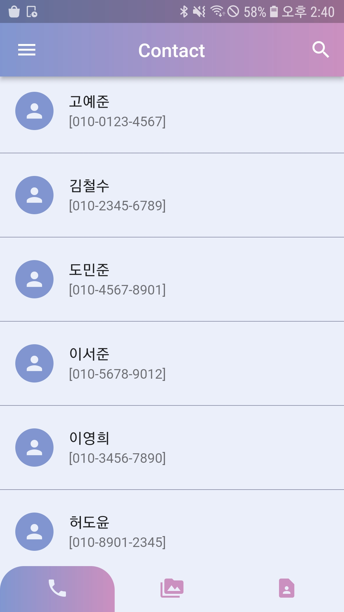
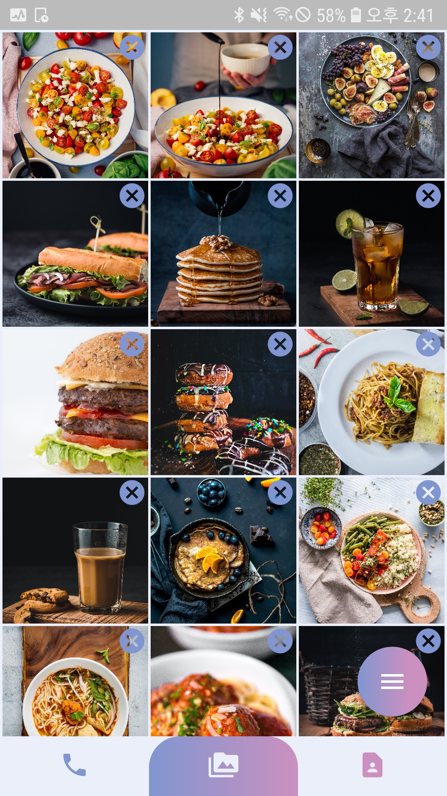
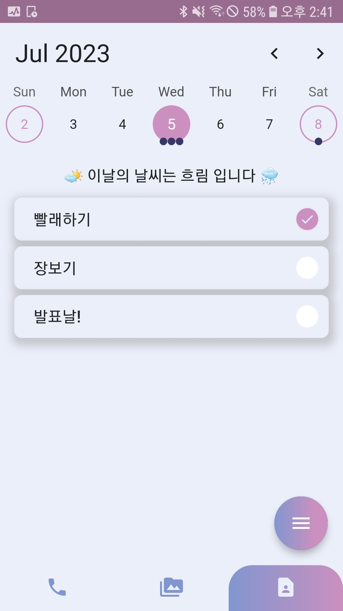
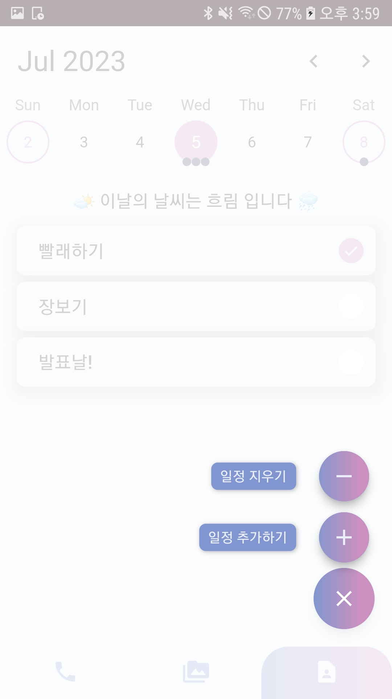
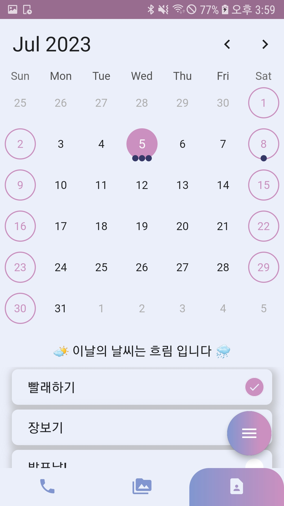

# CGC \(Contacts, Gallery, and Calendar\)
> MadCamp Week1 2분반 ?팀

* 주소록, 갤러리, 캘린더로 구성된 Flutter 기반 안드로이드 애플리케이션 입니다.
* 연락처 탭에서 기기의 연락처 정보를 리스트업할 수 있습니다.
* 갤러리 탭에서 기기의 사진 중 원하는 사진을 골라 게시할 수 있습니다.
* 캘린더 탭에서 ToDoList 작성과 앞으로 10일간의 일기예보를 확인할 수 있습니다.

||
---|---|---

### A. 개발 팀원
* [박이내](https://github.com/YinaePark)
* [하승종](https://github.com/hippo0419)
***

### B. 개발 환경
* OS: Windows 11(22H2), macOS(Ventura 13.4),
* Target: Android
* FrameWork: Flutter 3.10.1
* Language: Dart
* IDE: Android Studio, VSCode
* Target Device: Galaxy S7
* App built with default configuration of Flutter SDK 3.10.1
***

### C. 어플리케이션 소개  
### TAB 1 - 연락처
#### Magor features
* Tab1에서 휴대전화에 저장된 연락처를 확인할 수 있습니다.
  * 각 연락처를 클릭하면 상세 정보 페이지로 넘어갑니다.
  * 상세 정보 페이지에는 이름, 전화번호, 전화 및 문자 전송으로 넘어가는 버튼이 표시됩니다.
* Contact tab 우측 상단의 검색 버튼으로 연락처를 검색할 수 있습니다
  * 검색어를 포함하는 연락처 리스트가 표시됩니다.
  * 검색 결과로 표시된 연락처를 클릭하면 상세 정보 페이지로 넘어갑니다.
***

#### 기술 설명
* FutureBuilder를 사용하여 연락처 정보를 표시한다. 
  * permission_handler를 이용하여 연락처 읽기, 전화 걸기, 문자 보내기 권한을 가져온다.
  * fast_contacts를 사용하여 휴대전화에 저장된 연락처 정보를 가져온다.
  * 결과를 ListView로 표시한다.
* url_launcher를 이용하여 전화 걸기, 문자 보내기를 실행한다.
* material library의 showSearch function을 이용하여 입력한 query를 포함하는 연락처 리스트를 표시한다.
***
### TAB 2 - 갤러리
<!-- ||
---|---|--- -->
#### Major features
* 기기에서 선택한 사진을 리스트업할 수 있습니다.
* 하단 플로팅 버튼과, 이미지 우측 상단의 버튼을 통해 사진을 추가/삭제할 수 있습니다.
  * 사진 추가하기 버튼 클릭시, 기기의 사진을 여러개 선택하여 추가할 수 있습니다.
  * 사진 모두 지우기 버튼 클릭시, 앱에 표시되는 사진을 전부 지울 수 있습니다.
  * 이미지 우측 상단의 버튼 클릭시, 사진을 개별적으로 지울 수 있습니다.
* 사진을 탭하여, 크게 볼 수 있습니다.
* 사진이 확대된 상태에서, 좌우로 슬라이드하여 이전, 이후의 사진을 볼 수 있습니다.
***
#### 기술 설명
1. 갤러리 구현
* 사진의 경로 목록을 리스트로 관리
* GridView 위젯 내부에 리스트의 순서대로 버튼 이미지 위젯 배치
2. 플로팅 버튼 구현
* SpeedDial 위젯을 사용
* TAB3에서도 재사용하기 위해 컴포넌트화하여 관리
3. 슬라이더 구현
* [carousel_slider](https://pub.dev/packages/carousel_slider) 라이브러리 사용
***

### TAB 3 - 캘린더
||
---|---|---

#### Major features
* 캘린더를 선택하여 특정 날짜이 ToDoList를 조회할 수 있습니다.
* 하단 플로팅 버튼을 통해 계획을 추가/삭제할 수 있습니다.
  * 일정 추가하기 버튼 선택시, 텍스트로 이루어진 일정을 추가할 수 있습니다.
  * 일정 지우기 버튼 선택시, 체크한 일정을 삭제할 수 있습니다.
* 추가한 계획은 캘린더 하단에 리스트업됩니다.
* 계획을 탭하면 체크되어 완료한 일정을 구분할 수 있습니다.
* 캘린더는 주말과, 오늘, 선택한 날짜를 시각적으로 표현합니다.
* 각 날짜의 일정 갯수가 시작적으로 캘린더에서 표현됩니다.
* 캘린더를 상하로 스와이프하여 캘린더 포맷을 변경할 수 있습니다.
* 오늘부터 10일 이후까지의 날씨가 캘린더와 ToDoList 사이에 출력됩니다.
***

#### 기술 설명
1. 캘린더 구현
* [TableCalendar](https://pub.dev/packages/table_calendar) 라이브러리를 커스터마이징하여 사용
1. 플로팅버튼 구현
* [TAB2]()와 동일한 기술 적용
1. ToDoList 구현
* Listview 위젯을 사용
* 디자인은 오픈소스 UI 라이브러리인 [GetWidget](https://docs.getwidget.dev/) 사용
* ToDoList는 JSON 문자열로 가공하여 Preference에 저장
1. 일기예보 구현
* [공공데이터 포털](https://www.data.go.kr/) 의 단기예보, 중기예보 API 사용
